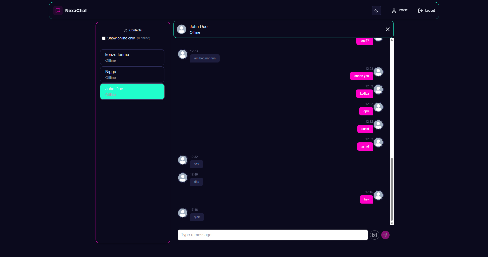
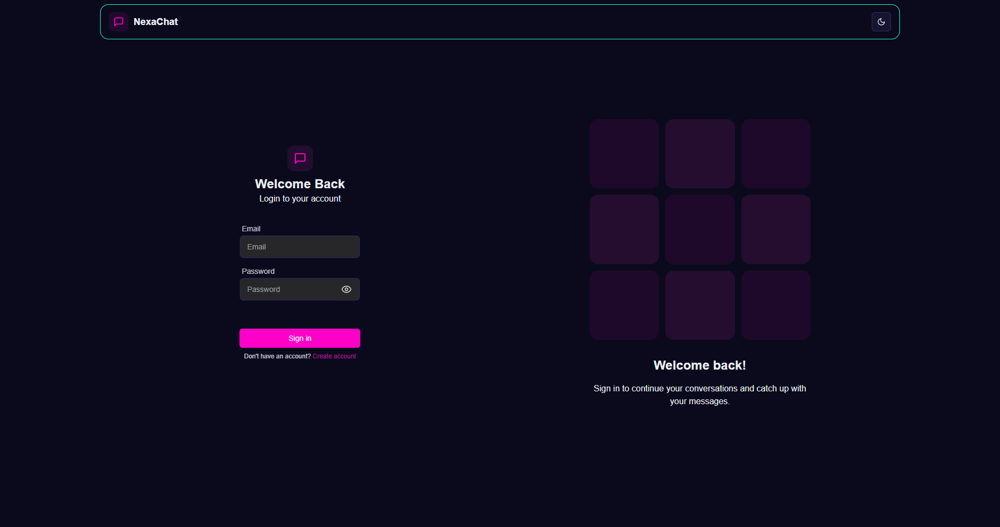
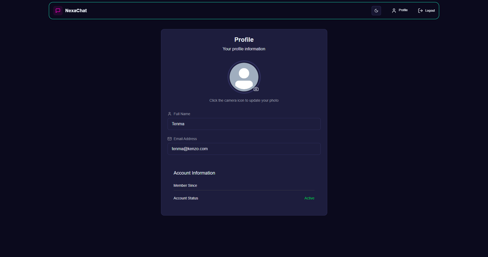

# Nexa Chat

[](https://nexa-chat-gajendra.vercel.app/)
[](LICENSE)
[](https://socket.io/)
[](https://www.mongodb.com/mern-stack)

A professional, full-stack real-time chat application built with the MERN stack and Socket.IO. Nexa Chat offers secure one-on-one messaging with a sleek cyberpunk-inspired interface.



## Features

- **Real-time messaging** powered by Socket.IO
- **Secure authentication** using JWT
- **Responsive design** that works on all devices
- **Cyberpunk theme** with light and dark mode support
- **User presence** (online/offline status indicators)
- **Cloud-based storage** for profile images via Cloudinary
- **Persistent chat history** stored in MongoDB
- **ShadCN UI components** with TailwindCSS styling
- **State management** using Zustand

## Tech Stack

### Frontend
- React.js (with Vite)
- TailwindCSS
- ShadCN UI
- Zustand for state management
- Socket.IO client

### Backend
- Node.js
- Express.js
- MongoDB (Cloud Atlas)
- Socket.IO server
- JWT for authentication
- Cloudinary for image storage

## Screenshots

<div align="center">
  
  
  
</div>

## Installation

### Prerequisites
- Node.js (v16 or later)
- MongoDB (local or Atlas URI)
- Cloudinary account

### Setup Instructions

1. **Clone the repository**
   ```bash
   git clone https://github.com/0xGajendra/nexa-chat.git
   cd nexa-chat
   ```

2. **Install dependencies for both frontend and backend**
   ```bash
   # Install backend dependencies
   cd backend
   npm install
   
   # Install frontend dependencies
   cd ../frontend
   npm install
   ```

3. **Environment Variables**

   For the backend, create a `.env` file in the backend directory:
   ```
   PORT=3000
   MONGODB_URI=mongodb://localhost:27017/mydatabase
   JWT_SECRET=mysecretkey
   FRONTEND_URL=http://localhost:5173
   CLOUDINARY_CLOUD_NAME=cloudname
   CLOUDINARY_API_KEY=apikey
   CLOUDINARY_API_SECRET=apisecret
   ```

   For the frontend, create a `.env` file in the frontend directory:
   ```
   VITE_BASE_URL=http://localhost:3000
   ```

4. **Run the application**
   ```bash
   # In the backend directory
   npm run dev
   
   # In the frontend directory (open a new terminal)
   npm run dev
   ```

5. **Access the application**  
   Open your browser and visit `http://localhost:5173`

## Usage

1. **Register/Login**: Create a new account or login with existing credentials
2. **Profile Setup**: Upload a profile image and update your information
3. **Start Chatting**: Click on a user to begin a one-on-one conversation

## Future Improvements

- Group chat functionality
- Message editing and deletion
- Read receipts
- Voice/video calling integration
- End-to-end encryption
- Mobile application using React Native
- File sharing capabilities

## Contributing

1. Fork the repository
2. Create your feature branch (`git checkout -b feature/amazing-feature`)
3. Commit your changes (`git commit -m 'Add some amazing feature'`)
4. Push to the branch (`git push origin feature/amazing-feature`)
5. Open a Pull Request

## License

This project is licensed under the MIT License - see the [LICENSE](LICENSE) file for details.

## Connect with the Developer

- GitHub: [0xGajendra](https://github.com/0xGajendra)
- LinkedIn: [Gajendra](https://linkedin.com/in/gajendra-li)

---

**Keywords**: real-time chat app, MERN stack chat application, socket.io messaging, react chat app, JWT authentication app, cyberpunk UI, one-on-one messaging, MongoDB chat storage, Zustand state management, TailwindCSS responsive design, ShadCN UI components, Cloudinary image upload, Vite React application, Socket.IO real-time communication, secure messaging platform